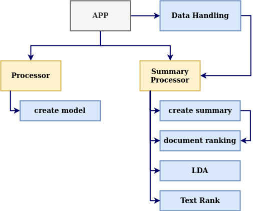
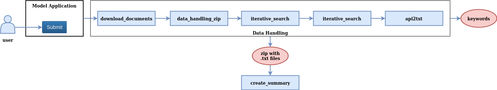
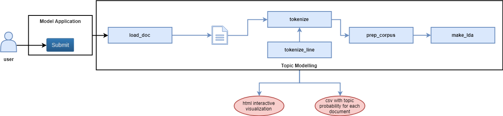
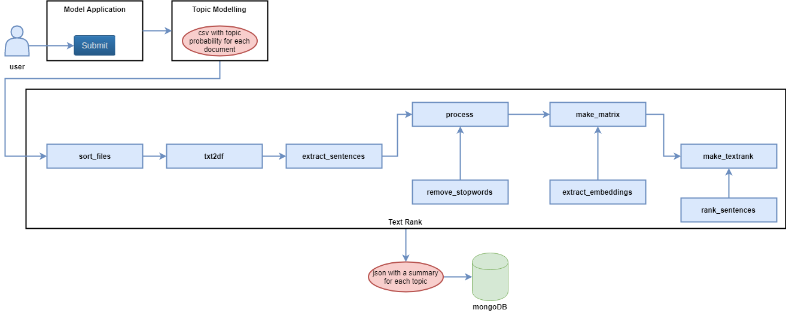
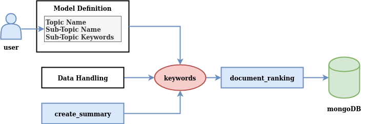

.. Smart Reader documentation master file, created by
   sphinx-quickstart on Thu Dec 12 10:25:43 2019.
   You can adapt this file completely to your liking, but it should at least
   contain the root `toctree` directive.

Welcome to Smart Reader's documentation!
========================================

.. toctree::
   :maxdepth: 2
   :caption: Contents:

Indices and tables
==================

* :ref:`genindex`
* :ref:`modindex`
* :ref:`search`

Data Handling
=============

This module is in charge of generating the document corpus on which the user applies the models.
Once there is at least one model already generated, we can select it from the Model Application interface and apply over
a documents corpus. Such corpus is composed by:

* Downloaded documents from open APIs (DSpace, Cornell and Harvard), using as queries the subtopics that the user defines when the model is defined in Model Definition.
* Documents given by user from a zip file. This file is optional, so, it is not necessary that users have documentation about the topic to use the tool.

The number of documents is defined and configurable, combining both the user documents and the downloaded documents
from APIs (if the number of documents in zip file is lower than the number of total documents).

|

========

 .. automodule:: smart_reader_app.data_handling.user_data_handling
    :members:

 .. automodule:: smart_reader_app.data_handling.api_requests
    :members:

LDA Topic Modelling
===================

This module is in charge of the topic modelling functionality of Smart Reader. It processes the documents in the corpus
(provided by the user and extracted from the APIs) and performs the Latent Dirichlet Allocation algorithm. The
output of the module is an html interactive visualization where the topics are represented by circles, the most relevant
words are listed for each topic and the distance between the circles represents how alike the topics are. Other
functionalities as well as details can be found in the
`official documentation of the pyLDAvis package <https://pyldavis.readthedocs.io/en/latest/>`_
Along with the visualization, the module also outputs a csv file listing each of the documents with the
probabilities of belonging to each of the topics as well as the top probability topic.

The number of topics that will be computed is configurable from the configuration file by adjusting the `num_topics`
parameter but should be less than the total number of documents.

|

========

.. automodule:: smart_reader_app.model.lda
   :members:

Text Rank
=========

This module is in charge of the Text Rank functionality of Smart Reader. It processes the documents in the corpus
(provided by the user and extracted from the APIs), sorts the documents into folders by their dominant topic
and provides an extractive summary for each topic. The summary is constructed by globally extracting
the most relevant sentences from the documents of a given topic and ranking them with the Text Rank algorithm.

The length of the summaries is configurable from the configuration file by adjusting the `num_sentences` parameter,
allowing the user to chose the number of top sentences to display.

|

========

.. automodule:: smart_reader_app.model.textrank
   :members:

Document Ranking
================

This module is in charge of generating a ranking of the corpus of documents. It takes a TF-IDF matrix, which has all the
documents as rows and the corpus ngrams (n entre 1 y 3) as columns. To leverage the keywords extracted by the previous
processes (Data Handling and Create Summary modules), we weight all of them to adjust the ranking to the topic of
interest. All ngrams of the corpus will be weighted as follows:

.. math:: \small{w(ngram)=
    \begin{cases}
      \alpha, & \text{if}\ ngram \in keywords\\
      (1-\alpha), & \text{otherwise}
    \end{cases}}

In this way, the user can adjust the influence of the keywords list in the document ranking modifying
the `alpha_keywords` parameter in the configuration file, taking into account that this value has to be a float number
between 0 and 1.

Finally, the different origins of the keywords implies that the total number of keywords that are overweighted could be
too high. For this reason, the total number of keywords is set by user in the configurable
parameter `n_keywords_ranking`. This limit is applied considering that the source priority of the keywords is the
following: 1) keywords given by user at Model Definition, 2) keywords extracted from APIs at Data Handling and
3) keywords obtained from the created model.

|

Once the weighted TF-IDF matrix is obtained, a column sum is carried out, obtaining a score for each one of the
documents. In this way, the ranking will be a sorted list of the documents with higher score.

|

========

.. automodule:: smart_reader_app.model.document_ranking
   :members:

Utils
=====
 .. automodule:: smart_reader_app.utils.get_synonyms
    :members:

 .. automodule:: smart_reader_app.utils.zip2json
    :members:

Database
=========
.. automodule:: smart_reader_app.database.database_connectivity
   :members:

Logger
======
 .. automodule:: smart_reader_app.logger.logger
    :members:

Abstractive Summarization
=========================

Additionally, we have researched about abstractive summarization. To implement it, we have used the
`OpenNMT <http://opennmt.net//>`_ repository. It is a open repository, which has been carried out by the Harvard NLP
Group and SYSTRAN.

|

The steps for using this repository are described below:

* Clone the repository: ``git clone https://github.com/OpenNMT/OpenNMT-py.git``

* Create a virtual environment: ``python3.6 -m venv my_env``

* Install requirements: ``pip install -r docs/requirements.txt``

* It is possible to preprocess data using the repository `Preprocessing the data module <http://opennmt.net/OpenNMT-py/Summarization.html#preprocessing-the-data>`_.

* Moreover, the user has the possibility of training a new model using the `Training module <http://opennmt.net/OpenNMT-py/Summarization.html#training>`_.

* We recommend to use one of the pre-trained models available at `Scores and Models <http://opennmt.net/OpenNMT-py/Summarization.html#scores-and-models>`_. It is neccesary to copy the downloaded model at `available_models` folder. Concretely, we have used the OpenNMT Transformer model.

* For the inference, the user has to use the `Inference module <http://opennmt.net/OpenNMT-py/Summarization.html#inference>`_.

|

An execution example:

.. code-block:: bash

   python translate.py -model available_models/sum_transformer_model_acc_57.25_ppl_9.22_e16.pt -src data/prueba.txt -output pred_prueba_doc.txt -verbose -block_ngram_repeat 3 -replace_unk -batch_size 30 -beam_size 4 -stepwise_penalty -coverage_penalty summary -beta 10 -ignore_when_blocking "." "</t>" "<t>"

Note that user has to specify where is saved the data in the ``src`` parameter and where the output will be saved using
the ``output`` parameter. The rest of parameters are described at Inference module.
